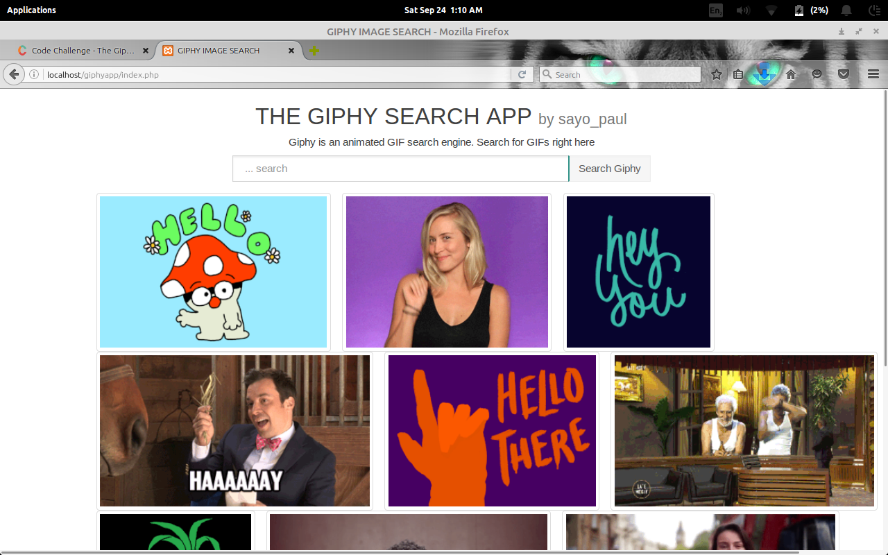

# # README # #

## Submission for Codeclass giphy API app challenge ##

### What is giphy app for ?? ###

**# * Get 10 beautiful gifs properly formatted for desktop ,obile and tablets, on any search term of your choice # !! .**

*### How do I get set up? ###*

* Because t was built with PHP, please ensure you are on a server. Just paste the folder on your server and visit the url. An example is http://yourserversurl.com/giphyapp . If you want to run it offline, there are various guides to help you on various platforms. A good installer for APACHE(offline web server) is XAMPP it works on Windows, OSX and Linux. You can search for it on google. But you will still need to use the internet to connect to giphy :) .

* Deployment instructions - Please ensure you have a working internet connection so as to search the internet. That's all , if there are any other errors, the app will tell you specifically.

* Repo owner - sayopaul 2016.
* Other community or team contact- http://funaabair.airviewdevs.com
